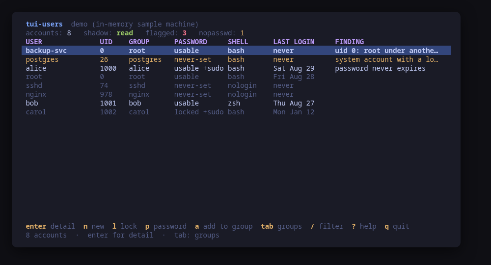
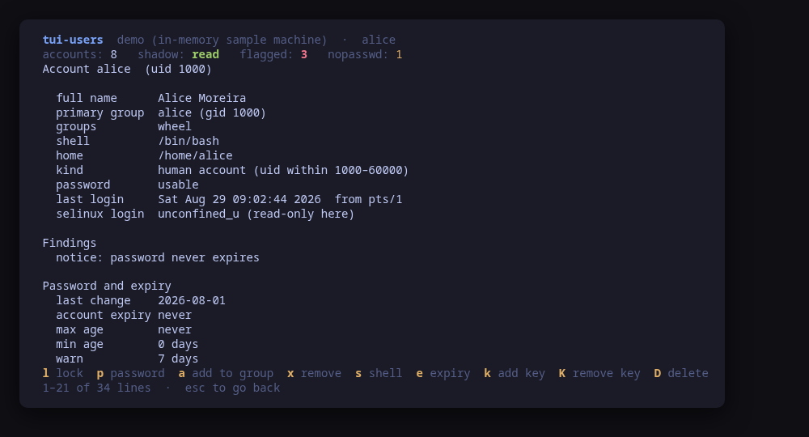
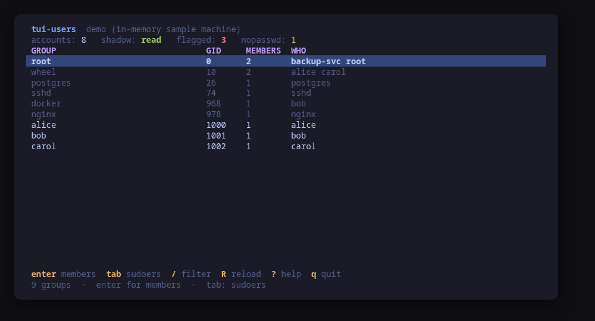
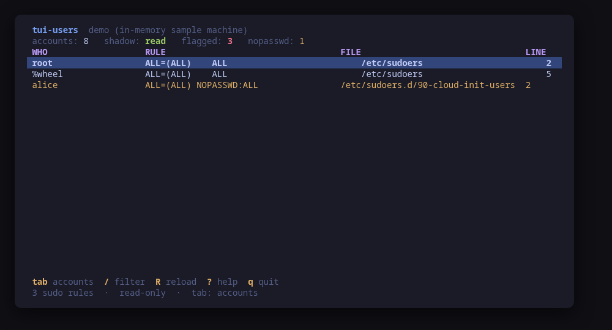
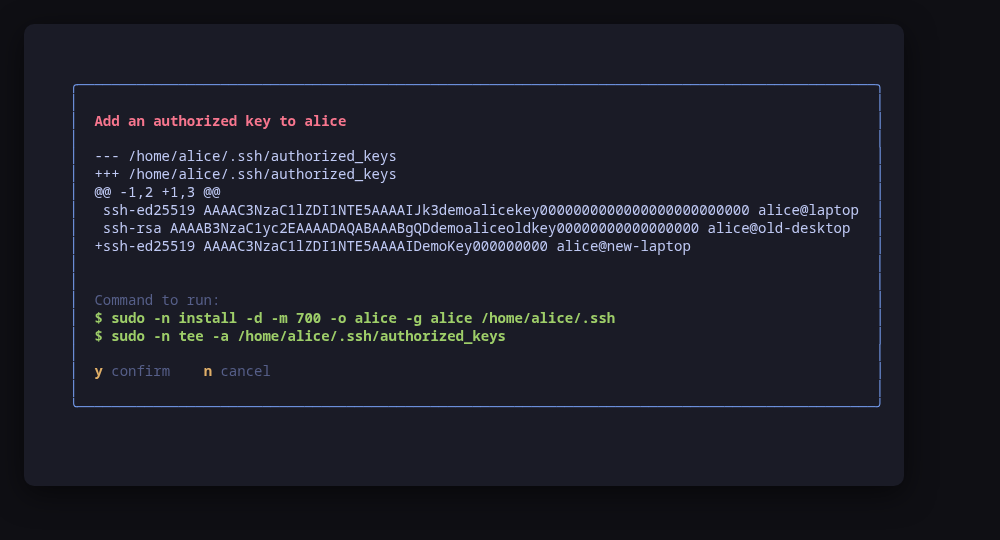
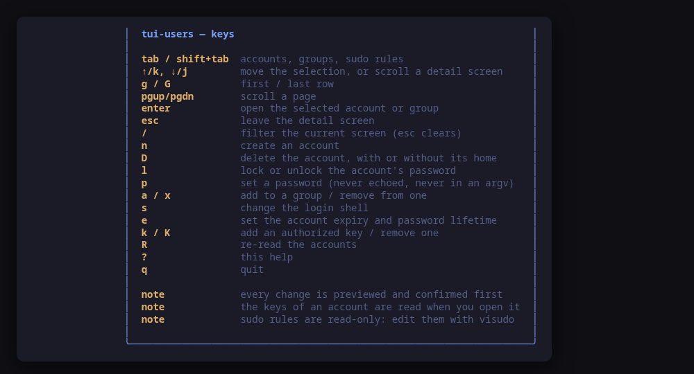

[](https://scorecard.dev/viewer/?uri=github.com/tui-tools/tui-users)
[](https://www.bestpractices.dev/projects/14368)

> **Beta.** The family is days old and still changing. Package names, flags
> and keys may move without notice until 1.0. Pin versions, and report what
> breaks.

A terminal UI for the machine's local accounts. It shows who exists, what each
account can do, which keys let them in and what sudo grants them — and
**previews the exact command line of every change before running it**.

The account database has no TUI: you get `getent`, `chage -l`, `passwd -S`,
`cat ~/.ssh/authorized_keys` and a careful read of `/etc/sudoers`, in five
different terminals. `tui-users` puts them on one screen, in the
[Omarchy](https://omarchy.org) visual style.



> **Status: early, under validation.** An independent tool that follows the
> Omarchy visual style; it is **not** part of the Omarchy project and not
> endorsed by its maintainers. Expect rough edges.

## Install

<!-- install:start -->
<!-- Generated by tui-kit/tools/render-install.py from tool.json. -->
<!-- Edit the manifest, then run `make readme`. -->

### Arch Linux

Needs the tui-tools repository, which is a [one-time
setup](https://tui-tools.github.io/install/).

The one-liner detects the distribution and adds the repository and its signing
key:

```sh
curl -fsSL https://pkgs.tui.tools/install.sh | sh
```

Piping a script into a shell is not this family's style, so here is the same
setup by hand — read it, or read the script first with `curl -fsSL
https://pkgs.tui.tools/install.sh -o install.sh`:

```sh
curl -fsSL -o /tmp/tui-tools.asc https://pkgs.tui.tools/pubkey.asc
sudo pacman-key --add /tmp/tui-tools.asc
sudo pacman-key --lsign-key \
  "$(gpg --show-keys --with-colons /tmp/tui-tools.asc | awk -F: '/^fpr:/{print $10; exit}')"
printf '[tui-tools]\nServer = https://pkgs.tui.tools/arch/$arch\n' \
  | sudo tee -a /etc/pacman.conf
sudo pacman -Sy
```

Then, and for every other tool in the family:

```sh
sudo pacman -S tui-users
```

Upgrades then arrive with the rest of your system updates.

### Debian and Ubuntu

Needs the tui-tools repository, which is a [one-time
setup](https://tui-tools.github.io/install/).

The one-liner detects the distribution and adds the repository and its signing
key:

```sh
curl -fsSL https://pkgs.tui.tools/install.sh | sh
```

Piping a script into a shell is not this family's style, so here is the same
setup by hand — read it, or read the script first with `curl -fsSL
https://pkgs.tui.tools/install.sh -o install.sh`:

```sh
sudo install -d -m 0755 /etc/apt/keyrings
curl -fsSL https://pkgs.tui.tools/pubkey.asc \
  | sudo gpg --dearmor -o /etc/apt/keyrings/tui-tools.gpg
echo "deb [signed-by=/etc/apt/keyrings/tui-tools.gpg] https://pkgs.tui.tools/deb stable main" \
  | sudo tee /etc/apt/sources.list.d/tui-tools.list
sudo apt update
```

Then, and for every other tool in the family:

```sh
sudo apt install tui-users
```

Upgrades then arrive with the rest of your system updates.

### Fedora and RHEL

Needs the tui-tools repository, which is a [one-time
setup](https://tui-tools.github.io/install/).

The one-liner detects the distribution and adds the repository and its signing
key:

```sh
curl -fsSL https://pkgs.tui.tools/install.sh | sh
```

Piping a script into a shell is not this family's style, so here is the same
setup by hand — read it, or read the script first with `curl -fsSL
https://pkgs.tui.tools/install.sh -o install.sh`:

```sh
sudo rpm --import https://pkgs.tui.tools/pubkey.asc
sudo curl -fsSL -o /etc/yum.repos.d/tui-tools.repo https://pkgs.tui.tools/rpm/tui-tools.repo
sudo dnf makecache
```

Then, and for every other tool in the family:

```sh
sudo dnf install tui-users
```

Upgrades then arrive with the rest of your system updates.

### Any distribution, static binary

```sh
curl -fsSL https://github.com/tui-tools/tui-users/releases/download/v0.2.0/tui-users_0.2.0_linux_amd64.tar.gz | tar -xz tui-users
sudo install -m0755 tui-users /usr/local/bin/tui-users
```

One static binary. Verify it against checksums.txt from the same release.

### From source

```sh
git clone https://github.com/tui-tools/tui-users
cd tui-users && make build
sudo install -m0755 bin/tui-users /usr/local/bin/tui-users
```

Needs Go 1.27 or newer.

Not packaged for these yet; the static binary works everywhere in the meantime.

### Arch Linux (AUR) — coming soon

```sh
paru -S tui-users-bin
```

The -bin package installs the released static binary.

### openSUSE — coming soon

Needs the tui-tools repository, which is a [one-time
setup](https://tui-tools.github.io/install/).

```sh
sudo zypper install tui-users
```

The rpm repository is shared with dnf; zypper support is not tested yet.

### Verify a download

Every release of `tui-users` ships a `checksums.txt`. Check an archive against
it before installing:

```sh
sha256sum -c checksums.txt --ignore-missing
```
<!-- install:end -->

One static binary, no daemon, no state of its own. Nothing keeps running after
you quit.

## Try it without root

```sh
tui-users --demo
```

`--demo` runs against a sample machine: root, two people, a locked account, a
second account with uid 0, and the service accounts a real machine carries.
Every key works, every command is built and previewed for real, and nothing
touches your system.

## Findings first

The list is not alphabetical. The accounts worth a second look go to the top,
with the reason in a column next to them:

| Finding | Why it is one |
| --- | --- |
| `uid 0: root under another name` | A second uid 0 is root, and it appears in no `groups` output and in no sudoers file |
| `empty password: none is asked for` | The second field of `/etc/shadow` is empty: anyone who reaches a prompt is in |
| `system account with a login shell` | What a compromised service uses to become interactive |
| `password never expires` | A policy observation on a person's account, ranked as one |

What the tool cannot know it does not guess. Without `/etc/shadow` — which
needs root — the password state of every account is `unknown`, the header says
so, and an unknown state raises no finding.

## One account, in full



`enter` opens the selected account: its groups, its aging policy in words
rather than in days-since-1970, the authorized keys in its `~/.ssh` with their
type, comment and fingerprint, what `sudo` itself says it may run, the SELinux
user it maps to, and the sessions it has open right now.

## Groups, and sudo



`tab` moves between the three screens. The groups screen lists the members
`/etc/group` does not: an account's primary group does not name it as a member,
so a group can look empty while half the machine is in it.



The third screen quotes every rule in `/etc/sudoers` and `/etc/sudoers.d`, with
the file and line it came from, and marks the ones that run without a password.
It is read-only in v0.1 — see [below](#what-v01-cannot-do).

## Every change is previewed



`y` runs the commands shown, `n` does not. There is no other path to a change:
the UI hands the same values to the preview and to the runner, so what you read
is what executes.

A password is the one input that never appears in a preview, because it must
never appear in a command line either — an argv is readable in `ps` by every
user on the machine. It goes to `chpasswd` on standard input, and the dialog
shows `chpasswd` and a row of dots.

## Usage

```sh
tui-users                        # drive the real accounts
tui-users --demo                 # sample machine, no privileges needed
tui-users --check                # read the accounts, print JSON, exit
tui-users --check --user ana     # and read that one account in full
tui-users --report               # print what a bug report needs, exit
tui-users --theme ~/mytheme/colors.toml
tui-users --sudo ""              # run the commands directly (as root)
tui-users --version
```

### `--check`, for scripts and tests

`--check` is the non-interactive read path: it loads the accounts through the
same backend the UI would use, prints the parsed model as JSON and exits 0, or
exits 1 with the reason if the backend cannot be read. No UI, and it never
builds or runs a mutation, so it is safe to run anywhere.

```console
$ tui-users --check | head -16
{
  "tool": "tui-users",
  "version": "0.1.0",
  "backend": "shadow-utils",
  "describe": "shadow-utils via /usr/bin/sudo -n",
  "root": false,
  "shadowRead": true,
  "users": 42,
  "humans": 2,
  "system": 40,
  "groups": 68,
  "sessions": 2,
  "sudoersFiles": 3,
  "noPasswdRules": 1,
  "flagged": [
    {
```

The list read stops short of the per-account questions, because each of them is
another process per user: authorized keys and their fingerprints, the sudo rules
`sudo -l` reports, aging. `--user <name>` asks them for one account and adds the
answer under `detail`, which is what opening a row in the UI does. A name that
is not on the machine is an error rather than an empty `detail`.

```console
$ tui-users --check --user ana | grep -A 4 '"Keys"'
  "Keys": [
    {
      "Type": "ssh-ed25519",
      "Comment": "ana@laptop",
      "Fingerprint": "SHA256:2p0k…",
```

That path is worth naming separately because it is the one that escalates for a
file it cannot otherwise see: `~/.ssh/authorized_keys` is mode 600 inside a mode
700 directory owned by somebody else, so reading another account's keys means
`sudo -n`, and a tool that quietly returned no keys instead would look identical
to an account that has none.

A password hash never reaches it. The model carries the *state* of a password —
usable, locked, empty, never set, unknown — and never the hash, so a `--check`
report is safe to paste into a bug.

[tui-lab](https://github.com/tui-tools/tui-lab) uses it to test this tool
against real machines on Ubuntu, Fedora and Omarchy Server; the assertions live
in [`test/smoke.sh`](test/smoke.sh).

### `--report`, for bug reports

`--report` prints, in one block, everything a maintainer has to ask for
otherwise: the tool and kit versions, the account backend, the openssh version
the same probe the header uses read off the machine, the distribution, the
kernel, the terminal, the theme, the escalation prefix, and whether the running
binary came from a package. It needs no privileges and reads no account, so it
works on the machine where the bug is — including one where the backend cannot
be built at all, which is itself a thing worth reporting.

```console
$ tui-users --report
tui-users 0.1.2 (kit v0.2.9)
backend: shadow-utils (version unknown: no shadow-utils program prints one)
mode: live
distro: fedora 42 (Fedora Linux 42 (Workstation Edition))
kernel: 6.19.14-108.fc42.x86_64
arch: x86_64
locale: en_US.UTF-8
term: xterm-256color
theme: tokyo-night
sudo: sudo -n
root: no
binary: /usr/bin/tui-users (packaged)
openssh: 9.9
```

The backend line carries no number because there is none to carry: no program
in shadow-utils prints a version. `openssh` does, and it is on its own line
because the key views are gated on it.

The block is written to be published as it is: it carries no hostname, user
name, home path or address, no account name, and no environment variable beyond
`LANG`, `LC_ALL`, `TERM` and `TERM_PROGRAM`. A binary living under your home
directory is reported as being there without naming the path. `--report` works
with `--demo` too, where it says so on the `mode` line.

The bug form asks for this block first — see
[`.github/ISSUE_TEMPLATE/bug_report.yml`](.github/ISSUE_TEMPLATE/bug_report.yml).

Most reads need no privileges at all — `getent passwd`, `getent group`,
`lastlog` and `loginctl` answer to any user, and `tui-users` never escalates for
them. Three reads do: `/etc/shadow`, the sudoers files, and another account's
`chage -l`. Those and every change use `sudo -n`, which never prompts, so run
`sudo -v` in another terminal first, or start `tui-users` with sudo.

## What it can do to your machine

Every one of these is previewed and confirmed first.

| Key | What runs |
| --- | --- |
| `n` | `useradd [-m] [-r] [-s <shell>] [-c <comment>] [-G <groups>] <name>`, or `groupadd [-g <gid>] <name>` on the groups screen |
| `D` | `userdel <name>`, or `userdel -r <name>`; `groupdel <name>` on the groups screen |
| `l` | `usermod -L <name>` / `usermod -U <name>` |
| `p` | `chpasswd`, with `user:password` on standard input |
| `a` / `x` | `gpasswd -a <user> <group>` / `gpasswd -d <user> <group>` |
| `S` | `gpasswd -a <user> <sudo group>` / `gpasswd -d <user> <sudo group>` |
| `s` | `usermod -s <shell> <user>` |
| `e` | `chage -E <date> <user>`, `chage -M <days> <user>` |
| `K` | `install -d -m 700 -o <user> -g <group> ~/.ssh`, then `tee -a ~/.ssh/authorized_keys`, or `install -m 600 -o <user> -g <group> <staged file> ~/.ssh/authorized_keys` to remove one |

Nothing else. There is no code path that writes to `/etc/sudoers`, and none
that writes anywhere but an account's own `~/.ssh` — the home directory is
validated first, and a relative one, `/`, or one carrying `..` is refused.

### Sudo is a group, and the machine says which one

`S` grants or revokes sudo, and the group it edits is the one that grants sudo
**on this machine**: `wheel` on Arch, Fedora and RHEL, `sudo` on Debian and
Ubuntu. The tool looks for the first of `wheel`, `sudo` and `admin` that exists
here, and the confirm dialog names the one it found — the same fact is what the
`+sudo` marker in the password column and the `member of` line on the detail
screen are built from.

A machine where none of the three exists gets no guess: the action is refused
with the reason, because sudo is then granted by a rule in a sudoers file and
this tool does not write those.

The last account holding sudo cannot lose it here. Revoking from the only
member of the group would leave the machine with no administrator but `root`,
which is the one mistake a confirm dialog does not undo, so the key refuses it
and says so.

### Groups are created empty and deleted empty

`n` on the groups screen creates a group; the GID is optional and empty lets
`groupadd` take the next free one from the machine's own range. `D` deletes
one, and only ever an **empty** one: a group somebody has as their primary
group is refused, and so is one with supplementary members, because emptying it
would silently change what each of those accounts can do. Members are added and
removed from an account's own screen, with `a` and `x`.

A **system group** — one outside the GID range `/etc/login.defs` declares — is
refused unless its name is typed back, because a package created it and expects
to find it there.

### Locking is not disabling

`usermod -L` puts a `!` in front of the stored hash, exactly as `passwd -l`
does, and `-U` takes it back off: the password stops working and unlocking
restores it. It stops **password** logins only. An account with an authorized
key still logs in over SSH, which is why the confirm dialog says so and names
how many keys the account has.

## Keys

| Key | Action |
| --- | --- |
| `tab` / `shift+tab` | Accounts, groups, sudo rules |
| `↑`/`k`, `↓`/`j` | Move the selection, or scroll a detail screen |
| `g` / `G` | First / last row |
| `pgup` / `pgdn` | Scroll a page |
| `enter` | Open the selected account or group |
| `esc` | Leave the detail screen |
| `/` | Filter the current screen (matches any column; `esc` clears) |
| `n` | Create an account, or a group on the groups screen |
| `D` | Delete the account, with or without its home directory; or an empty group |
| `l` | Lock or unlock the account's password |
| `p` | Set a password (never echoed, never in an argv) |
| `a` / `x` | Add to a group / remove from one |
| `S` | Grant or revoke sudo, through this machine's own sudo group |
| `s` | Change the login shell |
| `e` | Set the account expiry and the password lifetime |
| `K` | Add an authorized key, or remove one, with a diff to confirm |
| `R` | Re-read the accounts |
| `?` | Help |
| `q` | Quit |

In a **form**: `tab` / `shift+tab` move between fields, `←`/`→` cycle a choice,
`enter` opens a picker on a choice field and submits from a text field, `esc`
cancels.



## What v0.1 can do

- Read every account from `getent passwd`, every group from `getent group`, and
  the password state and aging of each from `getent shadow` when it can.
- Tell a person's account from a service's using the UID ranges in
  `/etc/login.defs`, which are the machine's own.
- Show the last login from `lastlog2` (or `lastlog`), and where one account last
  logged in from with `last -n1 -w`.
- Open one account in full: groups resolved by `id -Gn`, aging from `chage -l`,
  the authorized keys of its `~/.ssh` fingerprinted with `ssh-keygen -lf`, the
  rules `sudo -l -U` reports, its SELinux login mapping, and its open sessions
  from `loginctl`.
- List the groups with their real membership, primary members folded in.
- Quote every rule of `/etc/sudoers` and `/etc/sudoers.d`, marking `NOPASSWD`.
- Create and delete accounts, lock and unlock them, set a password, add and
  remove group memberships, change the login shell, set the account expiry and
  the password lifetime, and add or remove an authorized key.
- Create a group with `groupadd`, and delete an empty one with `groupdel`.
- Grant and revoke sudo with one key, through the group that grants it on this
  machine — refusing to take it from the last account that has it.
- Put the accounts worth a second look at the top, with the reason.
- Follow the active Omarchy theme, and respect `NO_COLOR`.

## What v0.1 cannot do

- **No sudoers editing.** The rules are read and shown; changing one is
  `visudo`'s job, because a syntactically invalid sudoers file locks everybody
  out of root and only `visudo -c` stands between you and that. A guarded editor
  is the obvious next step and is deliberately not in v0.1.
- **No SELinux management.** The login mapping is shown where `semanage` exists;
  changing it belongs to a tool that owns SELinux.
- **No changing a group's members from the groups screen.** A group is created
  empty and deleted empty; membership is edited from the account, with `a` and
  `x`. There is no renaming a group and no changing its GID either.
- **No password policy beyond `chage`**: no PAM, no `pwquality`, no faillock.
- **No LDAP, no systemd-homed, no AD.** `getent` answers for whatever NSS
  serves, so such accounts are *listed*, but every change here is a
  shadow-utils command and would fail on one.
- **No home directory management** beyond `useradd -m` and `userdel -r`.
- Keys are appended and removed whole. A restricted line (`command="…"`) is
  shown and can be removed, and the tool will not write one.

## Compatibility

<!-- compat:start -->
<!-- Generated by tui-kit/tools/render-compat.py from tool.json. -->
<!-- Edit the manifest, then run `make readme`. -->

`tui-users` probes its backend once at startup and shows the version in the
header. A version nobody has tested is marked `(untested)` there rather than
hidden; one below the minimum is marked as such and the tool still runs.

### shadow-utils

| | |
| --- | --- |
| Binary | `useradd` |
| Version read with | nothing: these tools report no version |
| Minimum | 4.8 |
| Tested | none yet |

| Versions | What changes |
| --- | --- |
| `>=4.8` | shadow-utils prints no version from any of its programs: `useradd --version`, `chage --version` and every sibling answer "unrecognized option" on Arch, Debian and Fedora alike. This backend therefore declares no version command, and the header shows none for it |
| `>=4.8` | the minimum above is informative, not enforced: it is the release whose flags this tool uses (`useradd -r -m -G`, `usermod -L -U -s`, `userdel -r`, `gpasswd -a -d`, `groupadd -g`, `groupdel`, `chage -E -M -l`), all far older than any supported distribution |
| `>=4.8` | reading the lock state and the expiry of an account needs `getent shadow`, which needs root; an unprivileged run lists every account and says the password state is unknown rather than implying it is fine |

### openssh

| | |
| --- | --- |
| Binary | `ssh-keygen` |
| Version read with | `ssh -V` |
| Minimum | 8.2 |
| Tested | `9.6`, `10.2`, `10.5` |
| Version-gated features | `security-keys` (since 8.2) |

| Versions | What changes |
| --- | --- |
| `<8.2` | `ssh-keygen -l` does not know the `sk-` key types, so a FIDO security key in an authorized_keys file cannot be fingerprinted and adding one is warned about: sshd would ignore the line it wrote |
| `<6.8` | `ssh-keygen -l` prints MD5 fingerprints rather than SHA256, so the fingerprint column will not match what a modern `ssh-keygen -lf` shows elsewhere |

The tested versions are generated from `compat/results.jsonl`, which the tool's
own smoke test appends to when it runs against a real machine in
[tui-lab](https://github.com/tui-tools/tui-lab).
<!-- compat:end -->

### On the missing version

`shadow-utils` prints no version from any of its programs. `useradd --version`,
`usermod --version`, `chage --version` and `passwd --version` all answer
`unrecognized option` — verified in containers of Debian 12, Ubuntu 24.04 and
Arch, and on Fedora 42. There is no flag to ask, and the package manager that
would know is a different one on each distribution.

So this tool declares the backend without a version command, and the header
shows a number for `openssh` instead — which is a version that genuinely
changes what the tool can do, since `ssh-keygen -l` learned the `sk-` key types
in 8.2. The flags `tui-users` uses (`useradd -r -m -G`, `usermod -L -U -s`,
`userdel -r`, `gpasswd -a -d`, `groupadd -g`, `groupdel`, `chage -E -M -l`) are
older than any supported distribution, which is why a shadow-utils minimum is
stated and not enforced.

## Configuration

`/etc/tui-users/config.toml`, then `~/.config/tui-users/config.toml` (the user
file overrides the machine-wide one), then `TUI_USERS_*` in the environment.
Flags override everything. See [`examples/config.toml`](examples/config.toml).

```toml
# Privilege escalation prefix; "" runs the command directly.
sudo = "sudo -n"

# Path to an Omarchy-style colors.toml; empty follows the active theme.
theme = ""
```

## Theme

The default palette is **Tokyo Night**. On Omarchy, the tool reads the active
desktop theme from `~/.config/omarchy/current/theme/colors.toml` and follows it.
`TUI_THEME` or `--theme` override; `NO_COLOR` drops color and keeps layout. The
rules live in [tui-kit](https://github.com/tui-tools/tui-kit#theme-rules).

## Architecture

The UI never builds a `useradd` command line. It talks to
`internal/accounts.Backend`, which returns a backend-neutral model:

```
Model{Root, ShadowRead, Users, Groups, Sudoers, Sessions, Limits}
User{Name, UID, GID, PrimaryGroup, Groups, Shell, Home, System,
     Password, Aging, LastLogin, Keys, Sudo, Sessions, SELinuxLogin, Flags}
Group{Name, GID, Members, Primary, System}
SudoersFile{Path, Raw, Entries}
```

`internal/shadow` is the only package that starts a process. It drives the
account programs through one kit runner each — `getent`, `lastlog2`, `last`,
`loginctl`, `id`, `chage`, `sudo`, `semanage`, `ssh-keygen` for the reads;
`useradd`, `usermod`, `userdel`, `gpasswd`, `groupadd`, `groupdel`, `chpasswd`,
`chage`, `install` and `tee` for the changes — and
[`check-exec.sh`](https://github.com/tui-tools/tui-kit/blob/main/tools/check-exec.sh)
fails the build if any other package imports `os/exec`.

The read path is wide and shallow on purpose: one `getent passwd`, one `getent
group`, one `getent shadow`, one `lastlog`, one `loginctl`. Asking `passwd -S`
or `chage -l` per account would start a hundred processes on a mail server, so
the per-account programs run only on the detail screen, for the one account on
it.

Mutations are `runner.Command` values produced by the backend. The UI shows them
and, on confirmation, hands the same ones back to the
[kit runner](https://github.com/tui-tools/tui-kit#the-contract-preview-confirm-run),
which resolves the binary and the privilege prefix. That is the whole trust
boundary, and it is why the preview is guaranteed to match what executes.

## Development

```sh
make check        # gofmt, go vet, the exec boundary and the tests: what CI runs
make test
make build
make demo
make screenshots  # re-render the frames above from --demo
```

The parser tests run against captured output from real machines
(`internal/shadow/testdata`): `getent passwd`, `getent group`, `getent shadow`,
`chage -l`, `lastlog`, `lastlog2`, `last`, an `authorized_keys` file,
`ssh-keygen -lf`, `sudoers`, `sudo -l`, `loginctl`, `login.defs` and
`semanage login -l`, with the names and one routable network rewritten into the
documentation ranges.

Dependencies are deliberately small: Bubble Tea, Bubbles and
[tui-kit](https://github.com/tui-tools/tui-kit), which carries the palette, the
widgets, the config loader and the command runner shared by the whole family.

## Safety notes

- Deleting an account whose home directory goes with it cannot be undone, and
  the confirm dialog says which of the two you chose. An account that is logged
  in is refused before the command is even built.
- Removing somebody from `wheel` or `sudo` can lock the only administrator out
  of the machine. Both directions are marked destructive for that reason, and
  `S` refuses outright to take sudo from the last account that holds it.
- A group is deleted only when nothing is in it, and a system group only after
  its name has been typed back into a prompt. Neither refusal can be clicked
  through: they happen before the command exists.
- A password is written to `chpasswd` on standard input. It appears in no argv,
  no preview, no status line and no log.
- An authorized key is validated with `ssh-keygen -lf` — in a private temporary
  file — before any command exists, so a key that cannot be read is refused
  rather than landing in a file where it would sit silently doing nothing.
- Removing a key rewrites the file through a staged copy installed with the
  account's own ownership and mode, and refuses if the file changed since it
  was read.
- `tui-users` re-reads the accounts after every change, so what you see is what
  the system reports, not what the tool assumed.

## Contributing

Contributions arrive as pull requests, and the guide the whole family follows
is [CONTRIBUTING.md](https://github.com/tui-tools/tui-kit/blob/main/CONTRIBUTING.md)
in tui-kit. A vulnerability goes to
[SECURITY.md](https://github.com/tui-tools/tui-kit/blob/main/SECURITY.md)
instead, never into a public issue.

## License

MIT — see [LICENSE](LICENSE). Part of the
[tui-tools](https://github.com/tui-tools) family.
